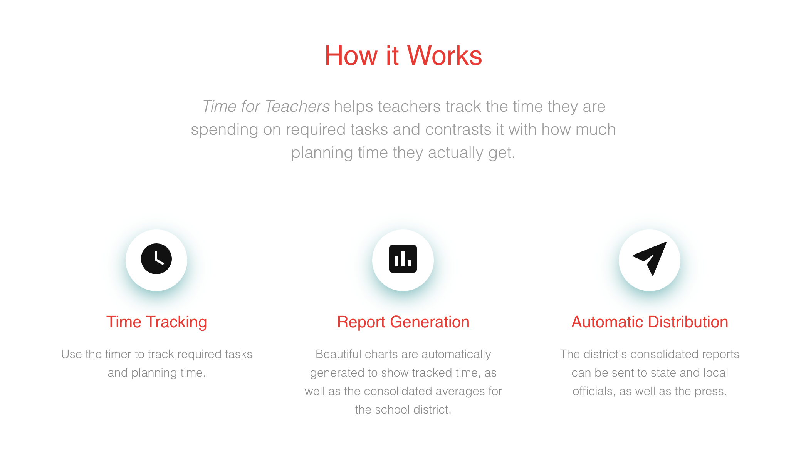
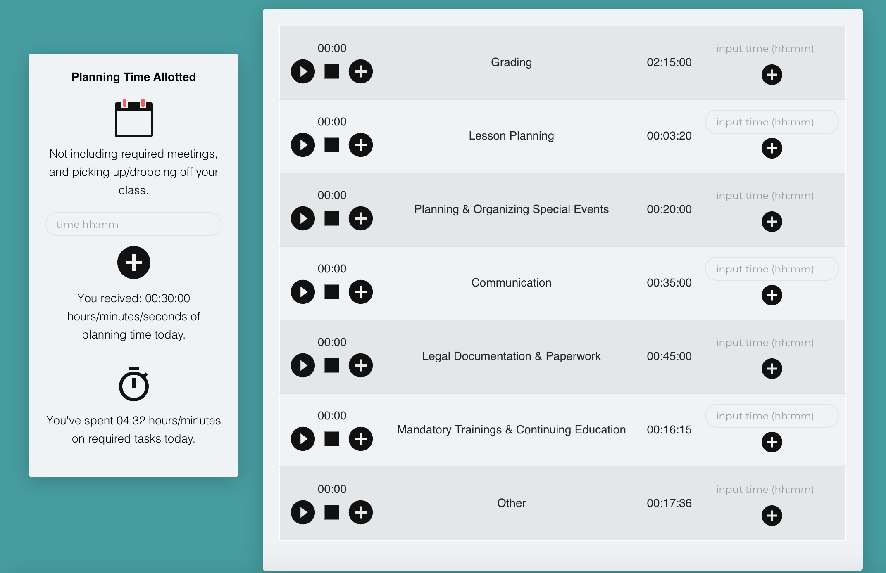
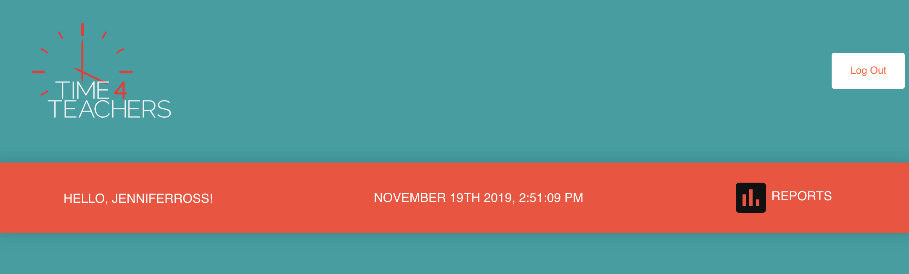
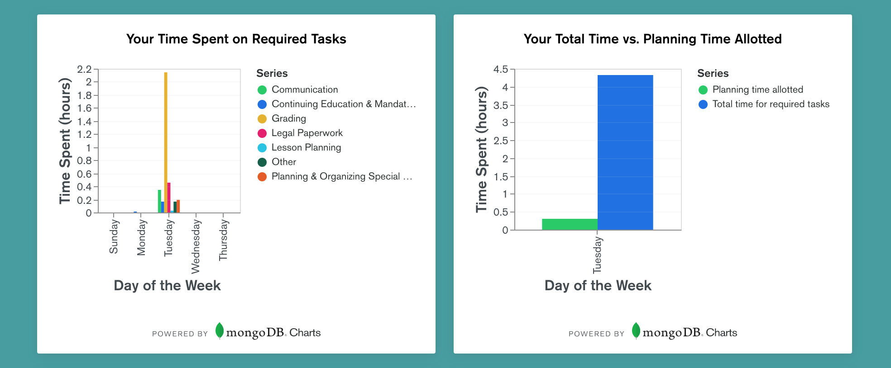
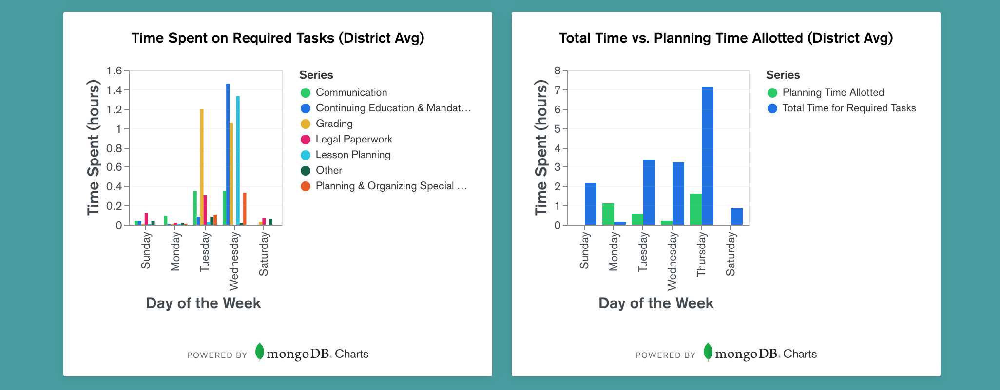

# Time for Teachers 

## About

"Time for Teachers" is a MERN stack web application that helps teachers track the time they are spending on required tasks and compare that with how much planning/contractual time they are allotted.

Check out the app [here](https://timeforteachers.us). 

## Technologies Used

- React 
- Reactstrap, CSS & SCSS 
- JavaScript
- Moment.js
- Node.js
- Express
- AWS (S3, CloudFront, Route53, Elastic Beanstalk, Cognito, Lambda)
- Mongoose 
- MongoDB Atlas
- MongoDB Charts 

## 

Each day teachers may log in and track the time they are spending on required tasks, which are broken down into common categories (grading, lesson planning, planning/organizing special events, continuing education/mandatory trainings, communication, and legal paperwork), on their dashboard. They can choose to use timers or manually input their time for each category. They may also manually input how much planning time they received that day on the left-hand side. Once they have begun logging times, they will see the planning time they were allotted and the total time spent on required tasks logged that day. 

To view bar graphs showing individual data and district averages broken down by day, teachers may click the reports button at the top of their dashboard. 

The two charts rendered at the top of the page show individual data, measured in hours. 

The two charts rendered at the bottom of the page show that school district's averages, measured in hours. 

## Goals & Next Steps 

In the coming months, additional features/functions will be added to the application to make it even easier to use and more effective. Our goal is to help individual teachers and teachers' unions in America consolidate consistent documentation to show how much time it actually takes to do the job. There is a reason why you see cars in school parking lots well after 4pm and teachers entering and exiting the building with bags (sometimes crates) full of paperwork and various odds and ends for activities. They have too much to do and not enough time to do it. 

According to "Phi Delta Kappan", a professional journal for educators, a recent study found that "most teachers have about 45 minutes of planning time per day within their contract hours, with a range from 12 to 80 minutes for elementary teachers and 30 to 96 minutes for secondary teachers". This already limited amount of time can often be swallowed by required meetings and taking care of basic needs (like going to the bathroom). And, since planning time is the only designated time in a teachers' contract for all of the common tasks outlined above, they are forced to do the required tasks on their own time, off the clock. The low pay teachers in the United States receive is justified due to it, on paper, being limited to these stringent and unrealistic contract hours. Often, a teacher's contractual hours add up to less than 40 hours per week, while they are putting in 60-80. 

We hope that this app will help bring more awareness of this very quantifiable issue to the general public, school boards, superintendents, and lawmakers at every level. We hope that the mounting outrage and documentation will assist in collective bargaining efforts that result in better pay, more teaching assistance, and more planning time. 

Immediate additions: 
    - Functions for updating and deleting times
    - Notifications to remind user that timer is still running every 30 minutes
    - SendGrid configuration to automate weekly report distribution via email

Future additions: 
    - Section for documenting how much money teachers are spending on their classrooms (upload pictures of receipts)
    - Mobile app (React Native)
    - Voice activation for timers

## Authors

- [Patrick Lake](https://github.com/plake492) 
- [Jennifer Ross](https://github.com/jenross)

